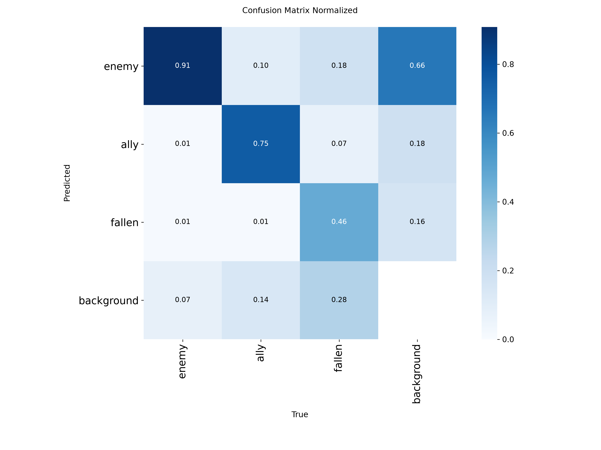

# Apex Legends 人物检测：YOLOv8n 三类别基线

本仓库记录使用 Ultralytics YOLO 对 Apex Legends 游戏画面进行目标检测的个人实验。当前公开的训练报告是 **YOLOv8n 三类别基线**，识别 `enemy`、`ally` 和 `fallen`。

> 数据集、原始视频、截图及标注是个人使用素材，不会上传；详见 [DATASET_NOTICE.md](DATASET_NOTICE.md)。本次指标来自验证集，不是独立测试集。

## 当前模型结果

YOLOv8n 使用 `yolov8n.pt` 预训练权重微调。训练最多 100 轮，在第 92 轮按 patience=20 早停；验证集最佳结果出现在第 72 轮。

| 类别 | 验证图片数 | 标注目标数 | Precision | Recall | mAP50 | mAP50-95 |
|---|---:|---:|---:|---:|---:|---:|
| enemy | 518 | 576 | 0.818 | 0.882 | 0.909 | 0.591 |
| ally | 114 | 134 | 0.767 | 0.739 | 0.789 | 0.506 |
| fallen | 66 | 71 | 0.732 | 0.479 | 0.547 | 0.317 |
| 总体 | 796 | 781 | 0.772 | 0.700 | 0.748 | 0.471 |

总体 Precision、Recall、mAP50、mAP50-95 是最佳轮次的验证指标。验证集中类别图片数可能有重叠；同一张图片可以包含多个类别。

`enemy` 检测最好；`fallen` 的 Recall 为 0.479，是当前主要短板。归一化混淆矩阵显示约 28% 的 fallen 漏检为背景，约 18% 被判为 enemy。后续应优先补充多姿态、遮挡、远距离的 fallen 样本，并复查标注一致性。较高的 mAP50 与较低的 mAP50-95 也说明严格定位精度还有提升空间。

### 训练曲线


### 验证集混淆矩阵



[PR 曲线](results/yolov8n-apex-3class/figures/BoxPR_curve.png) · [Precision 曲线](results/yolov8n-apex-3class/figures/BoxP_curve.png) · [Recall 曲线](results/yolov8n-apex-3class/figures/BoxR_curve.png) · [F1 曲线](results/yolov8n-apex-3class/figures/BoxF1_curve.png) · [原始混淆矩阵](results/yolov8n-apex-3class/figures/confusion_matrix.png)

逐轮训练指标见 [`results.csv`](results/yolov8n-apex-3class/results.csv)。

## 训练设置

- 模型：YOLOv8n（nano），从 `yolov8n.pt` 预训练权重微调
- 图片尺寸：640 × 640；batch size：4
- 最大训练轮数：100；早停 patience：20；最佳轮次：72；实际完成：92
- Optimizer：`auto`；设备：CUDA 0；workers：0
- 随机种子：0；deterministic：开启
- 数据：3,011 张训练图片；796 张验证图片、781 个验证标注目标
- 环境记录：Python 3.11、PyTorch 2.5.1、Ultralytics 8.4.158、NVIDIA GeForce RTX 3070 Laptop GPU

本轮训练曾暂停后从 `last.pt` 续训。训练期间出现过 `Corrupt JPEG data` 解码警告，但训练完成并产出验证结果；警告未定位到具体文件，建议复用数据前检查图片完整性。

## 本地数据准备

复制模板并把 `path` 改为本地数据集目录：

```powershell
Copy-Item data.example.yaml data.yaml
```

目录结构：

```text
apex_dataset/
├── images/
│   ├── train/
│   └── val/
├── labels/
│   ├── train/
│   └── val/
└── data.yaml
```

YOLO 标签每行格式为 `class_id center_x center_y width height`，坐标归一化到 0–1。类别 ID 顺序必须是 `enemy=0`、`ally=1`、`fallen=2`。

## 训练

安装 `requirements.txt` 指定的依赖，并准备本地 `data.yaml` 后运行：

```powershell
yolo detect train model=yolov8n.pt data=data.yaml epochs=100 imgsz=640 batch=4 patience=20 device=0 workers=0 project=runs name=yolov8n_apex seed=0 deterministic=True
```

此命令从预训练权重开始新的训练。续训时需要将模型路径指向对应 run 中的 `weights/last.pt` 并使用 `resume=True`。本仓库的 `.gitignore` 排除 `runs/`、`*.pt` 和本地 `data.yaml`；训练权重保留在本地，不纳入 Git 历史。

## 推理

训练完成后，在本地加载 `runs/yolov8n_apex/weights/best.pt`：

```python
from ultralytics import YOLO

model = YOLO("runs/yolov8n_apex/weights/best.pt")
results = model.predict("path/to/image.jpg", imgsz=640, conf=0.25)
```

`conf=0.25` 仅为示例阈值，应根据误检和漏检需求在独立数据上调整。此仓库未提供测试集结果。

## 文件与使用边界

- `data.example.yaml`：本地数据配置模板，不含数据集绝对路径。
- `training-config.yaml`：本轮训练参数与环境记录。
- `results/yolov8n-apex-3class/`：逐轮指标及训练、验证图表，不含原始图片。
- `DATASET_NOTICE.md`：私有数据集和素材说明。

本项目用于个人学习、数据标注和模型实验。请遵守游戏、平台和相关素材的使用条款，不要将模型用于破坏公平游戏体验的用途。本仓库未指定开源许可证。
