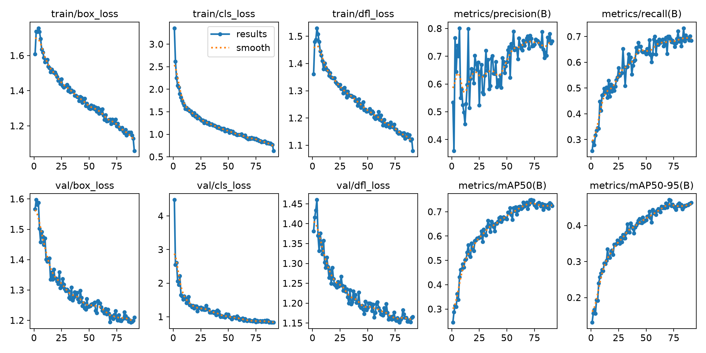
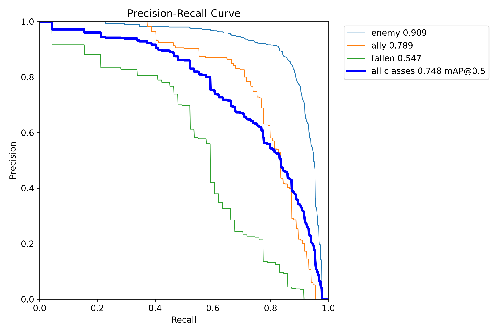

# Apex 画面目标检测：YOLOv8n 训练结果

本目录记录一次面向 Apex 游戏画面的三类目标检测实验。模型以 Ultralytics YOLOv8n（nano）预训练权重为起点，在自定义数据集上微调，用于识别 `enemy`、`ally` 和 `fallen`。本实验与仓库根 README 中的一类 `person` 基线是不同的数据划分和任务，指标不可直接横向比较。

> 本次报告中的指标来自训练过程使用的验证集，不是独立测试集。数据集图片与标注没有包含在本目录中。

## 结果摘要

- 最佳权重：保留在本地训练目录，未提交到仓库（仓库 `.gitignore` 排除 `*.pt`）
- 最佳轮次：第 72 轮（`results.csv` 以 0 起始记录为 epoch 71）
- 实际训练：92 轮；配置上限 100 轮，早停 patience 为 20
- 最佳总体指标：Precision 0.774、Recall 0.700、mAP50 0.748、mAP50-95 0.471
- 验证集：796 张图片、781 个标注目标
- 训练集：3,011 张图片

整体训练曲线显示训练与验证 loss 持续下降，检测指标在后半程趋于稳定。`enemy` 的识别效果最好；`fallen` 的召回率偏低，是后续补充样本和改进标注的优先方向。mAP50 与 mAP50-95 有明显差距，说明在较严格的 IoU 阈值下，定位精度仍有改进空间。

## 验证集指标

下表是最佳权重在验证集上的结果。Precision 表示预测目标中正确目标的比例；Recall 表示标注目标中被检出的比例；mAP50 和 mAP50-95 是不同 IoU 标准下的平均精度。

| 类别 | 验证图片数 | 标注目标数 | Precision | Recall | mAP50 | mAP50-95 |
|---|---:|---:|---:|---:|---:|---:|
| enemy | 518 | 576 | 0.818 | 0.882 | 0.909 | 0.591 |
| ally | 114 | 134 | 0.767 | 0.739 | 0.789 | 0.506 |
| fallen | 66 | 71 | 0.732 | 0.479 | 0.547 | 0.317 |
| 总体 | 796 | 781 | 0.772 | 0.700 | 0.748 | 0.471 |

类别图片数可能重叠：同一张图可以包含多个类别，因此类别图片数之和不等于验证集总图片数。

### 错误分析

归一化混淆矩阵中，enemy、ally、fallen 的对角线比例约为 0.91、0.75、0.46。fallen 约 28% 被漏检为背景，约 18% 被判成 enemy，约 7% 被判成 ally。后续可优先检查 fallen 的边界标注一致性，并增加不同姿态、遮挡程度、距离和画面亮度下的样本。也建议针对负样本单独统计误检率。

## 训练配置

| 项目 | 设置 |
|---|---|
| 模型 | YOLOv8n |
| 初始预训练权重 | `yolov8n.pt` |
| 检测类别 | `enemy`、`ally`、`fallen` |
| 图片尺寸 | 640 × 640 |
| Batch size | 4 |
| 最大训练轮数 | 100 |
| 早停耐心值 | 20 |
| Optimizer | `auto` |
| Device | CUDA 0 |
| DataLoader workers | 0 |
| 随机种子 | 0 |
| 确定性设置 | 开启 |
| 训练数据配置 | `dataset-template.yaml`（需要按本机数据位置调整） |

训练曾暂停并从 `last.pt` 续训。导出包只包含最终 `best.pt`，没有包含 `last.pt` 或中间轮次权重；因此下面的命令用于从预训练权重重新开始同配置训练，不是从原检查点精确续训。

运行环境记录：Python 3.11、PyTorch 2.5.1、Ultralytics 8.4.158、NVIDIA GeForce RTX 3070 Laptop GPU。

## 训练曲线与验证诊断

### 训练与验证曲线



### 归一化混淆矩阵


### Precision-Recall 曲线



其他诊断图：[`confusion_matrix.png`](figures/confusion_matrix.png)、[`BoxP_curve.png`](figures/BoxP_curve.png)、[`BoxR_curve.png`](figures/BoxR_curve.png)、[`BoxF1_curve.png`](figures/BoxF1_curve.png)。

## 文件说明

- 模型权重：最佳权重仅保留在本地训练目录中，本次提交不含 `.pt` 文件。
- `results.csv`：逐轮训练和验证指标；最佳 epoch 可从 `metrics/mAP50-95(B)` 列复核。
- `training-config.yaml`：环境和实验参数记录。
- `dataset-template.yaml`：三类数据集 YAML 模板；需要将路径改成自己的数据集路径。
- `figures/`：训练曲线、PR 曲线和混淆矩阵。

训练数据、原始游戏截图、验证样例图、Python 虚拟环境和 `epoch*.pt` 中间检查点均未包含。

## 使用模型

本次提交不包含模型权重。若你从本机训练产物或其他获准来源获得 `best.pt`，可按下面方式加载并预测：

```python
from ultralytics import YOLO

model = YOLO("path/to/best.pt")
results = model.predict("path/to/image.jpg", imgsz=640, conf=0.25)
```

如需视频推理，可将图片路径替换为视频文件路径。置信度阈值 `conf=0.25` 是示例值，应根据实际误检与漏检需求调整。

## 从预训练权重重新训练

先按 [`dataset-template.yaml`](dataset-template.yaml) 整理 YOLO 格式图片与标签，再运行：

```python
from ultralytics import YOLO

model = YOLO("yolov8n.pt")
model.train(
    data="dataset-template.yaml",
    epochs=100,
    imgsz=640,
    batch=4,
    patience=20,
    device=0,
    workers=0,
    project="runs",
    name="yolov8n_apex",
    seed=0,
    deterministic=True,
    save_period=10,
)
```

上面命令从 COCO 预训练权重开始一个新 run。若要续训，应把模型路径指向该 run 的 `weights/last.pt`，并启用 Ultralytics 的 resume 参数。

## 使用边界

本实验用于个人学习、数据标注和模型评估。请遵守游戏、平台与素材使用条款，不要将模型用于破坏公平游戏体验的用途。

## 数据、权重与许可证

本实验目录不包含训练集或验证集。复现实验需要自行准备有权使用的图片和对应 YOLO 标签，并检查类别顺序与 `dataset-template.yaml` 一致。公开模型前，应确认数据素材和预训练权重的许可条件；本目录没有替项目指定开源许可证。
